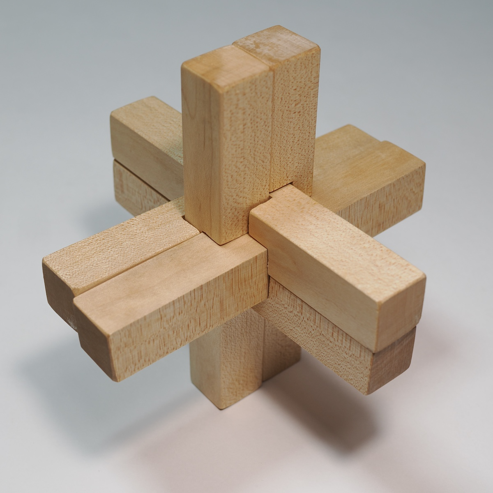
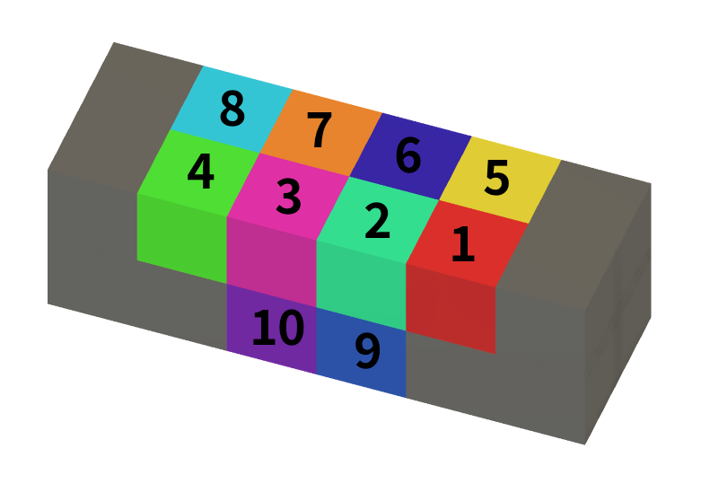

# 6-piece-burr-puzzle
Introducing a 3D model (STL File) of a 6 piece burr puzzle

## 1. 六本組み木
パズルとしての「6本組木（シックス・ピース・バー）」の歴史は非常に古く、世界中で愛され、職人たちの間で受け継がれてきました。現在確認されている最古の記録は、1785年にドイツで発行された「ベッテルマイヤーの玩具カタログ」だと言われています。 
 

ヨーロッパに記録が残る前から、中国や日本では「建築技術」の一環として組木の概念が存在していました。中国での釘を使わない建築構造の知恵や日本での寺社建築などで培われた「継手・仕口」の技術がベースにあります。 
書籍『Puzzles Old and New』(1893年)や『Puzzles in Wood』（1928年）で紹介されるようになって一般家庭で楽しむ「知的娯楽（パズル）」として広く定着しました。 
1978年に数学者でありプログラマーでもあったビル・カトラー（Bill Cutler）が、巨大なメインフレームコンピュータを使って全パターンを計算しました。 
以上AI調べ 

## 2. 六本組み木のバリエーション
組み木のピースには断面が長さ2aの正方形の直方体を使用します。組まれた状態で外から見えない部分を長さaの小さな立方体で分割して考えると、一番上の層から数えると4個、8個、8個、4個の合計24個です。この24個の立方体をどのように六本のピースに分配するか、ということがピースの設計になります。大前提ですが、六本の組み木はそれぞれちぎれていない一本のピースからできているという条件があります。つまり、各ピースは最低でも2個の小さな立方体で繋がるように配分されなければいけません。 
組まれた状態で外からは見えないのですが、内部にいくつか空洞がある組み木と、全く空洞がない組み木に分類できます。また、ノミのように各立方体を独立に切り落とすことのできる工具を使う場合に比べて、ノコギリのように前後に隣接する立方体を同時に切り落とす工具を使う場合には削る立方体の配置に制約があります。ここでは、空洞がなくノコギリで削り落とす場合（ノッチ式でソリッド）について考えます。 

## 3. ピースのID番号
24個の立方体を6本のピースに配分する多くの組み合わせの中から、ちぎれない、空間ができない、ノコギリで加工できる、組み立てることができるという条件に合うのは25個でした。 
一本のピースで削ることができるのは図に示した10箇所です。立方体11,12は図では見えませんが9,10の奥にあります。それらは"ちぎれない"という条件を満たすために削る対象から除外しています。 
 
ピースのIDとして削った場所を10ビットの数値で表しています。例えば1、2、5、6を削ってできるピースのIDは51ですが、2進数 "00 0011 0011" を10進数にした値です。 

## 4. おすすめの組み合わせ
3Dモデルを作成するのはそれほど大変なことではありません。小さな立方体を並べて組み木のピースを作って、IDに従って除去していけばいいのです。

[ID51](STL/ID51.stl) 
[ID791](STL/ID791.stl) 

